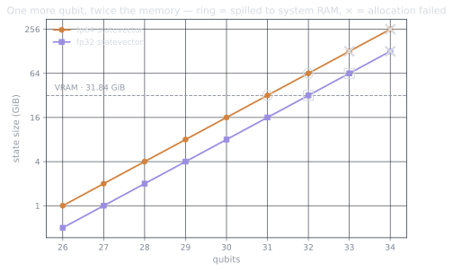

There's a particular kind of fun in leveraging consumer hardware for a
problem it was never marketed for. I have an RTX 5090 that nominally exists
for games and AI workloads, so the obvious question: how big a quantum
circuit can I *actually* simulate on it, at my desk, without touching a
cluster?

This series is me finding out, with benchmarks you can rerun — every number
comes from [this repo](https://github.com/drishans/one-gpu-n-qubits), measured
on the machine under my desk. The answer turned out to be more interesting
than the single number I expected, because the wall I went looking for isn't
where the arithmetic says it should be. More on that at the end.

## The exponential lives in memory, not in time

A statevector simulator is the bluntest possible instrument: store the entire
quantum state, apply every gate as a small matrix multiplied into it. The
state of $n$ qubits is a vector of $2^n$ complex amplitudes,

$$
|\psi\rangle = \sum_{i=0}^{2^n - 1} \alpha_i \, |i\rangle,
\qquad \sum_i |\alpha_i|^2 = 1,
$$

and that vector is the whole game. It doubles with every qubit you add. In
double precision -- `complex128`, 16 bytes per amplitude. The ladder looks
like this:

| Qubits | Amplitudes | State size |
| -----: | ---------: | ---------: |
|     20 |      ~10⁶  |     16 MiB |
|     26 |      ~10⁸  |      1 GiB |
|     28 |     ~10⁸·⁵ |      4 GiB |
|     30 |      ~10⁹  |     16 GiB |
|     31 |     ~10⁹·³ |     32 GiB |
|     33 |      ~10¹⁰ |    128 GiB |
|     40 |      ~10¹² |     16 TiB |

My card reports **31.8 GiB** of usable VRAM (marketing says 32 GB; the
runtime disagrees by a rounding error and reserves a slice for itself,
about 30.2 GiB is actually free once CUDA is warm). So before thinking about
speed at all, the arithmetic hands down a sentence: **30 qubits in fp64**
fits with headroom, 31 is exactly the size of the card, and each further
qubit doubles the bill. Drop to single precision and every row shifts one
qubit to the right.

No amount of GPU compute changes the size of the vector you have to
store. Compute is what you optimize *after* the state fits.

## Why a gate is a memory operation

Here's the part that makes GPUs the right tool and also caps what they can
do. Applying a 1-qubit gate $U$ to qubit $k$ pairs up amplitudes whose
indices differ in bit $k$ and hits each pair with a 2×2 matrix:

$$
\begin{pmatrix} \alpha_i' \\ \alpha_j' \end{pmatrix}
=
\begin{pmatrix} u_{00} & u_{01} \\ u_{10} & u_{11} \end{pmatrix}
\begin{pmatrix} \alpha_i \\ \alpha_j \end{pmatrix},
\qquad j = i \oplus 2^k .
$$

Four multiplies and two adds per pair (trivial math) but the pairs cover
the **entire statevector**. Every gate reads and writes all $2^n$ amplitudes.
At 30 qubits that's 16 GiB read + 16 GiB written *per gate*. The work is
almost pure memory traffic, which is exactly the regime a 5090 was built for:
GDDR7 moves roughly 1.7 TiB/s, an order of magnitude beyond any CPU socket
I'll ever own. Part 3 measures how close cuStateVec gets to that ceiling.

## What the series covers

- **Part 2** — getting the stack alive on Windows via WSL2: the wheels, the
  three errors you'll hit, and a Bell state as proof of life.
- **Part 3** — real circuits and the scaling data: what a gate costs from 24
  to 30 qubits, fp32 vs fp64, and why gate *locality* shows up in the
  timings.
- **Part 4** — the wall itself. This is where the plot twisted.
- **Part 5** — tensor networks: simulating circuits the statevector can't
  hold, and the different wall you buy instead.

## The spoiler, because field notes should be honest

I expected the experiment at 31 qubits to end with CUDA's version of a shrug
— `OutOfMemoryError`, series over, wall found. That is not what happened. On
a current driver, the allocation *succeeded*, the free-VRAM counter pinned
to zero, and the gate quietly took orders of magnitude longer. The modern
"wall" is soft: the driver spills your statevector into system RAM behind
your back and lets performance absorb the damage.

Which means the real question isn't "how many qubits fit." It's "how many
qubits fit *before the cliff*, where's the cliff, and how steep is it".
Those are measurable questions. Let's measure them.
