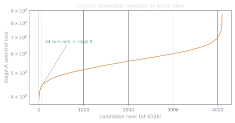
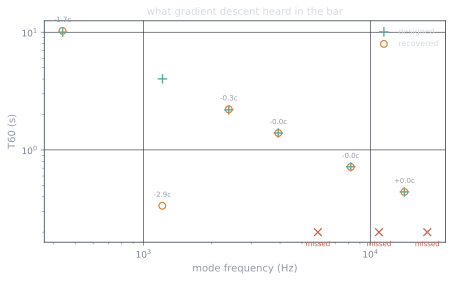
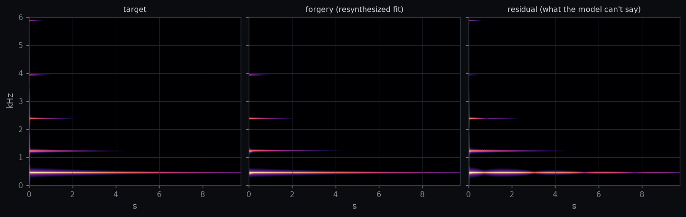
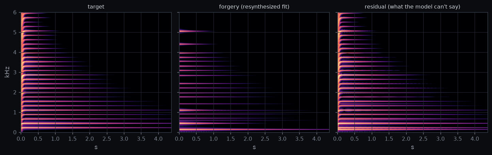

Part 1 built [a bar out of nine damped resonators](/writing/three-instruments-in-faust)
with decay times we verified to three significant figures. That exactness was
the point: the bar is a synthesizer whose true parameters we *know*. So here's
the inverse problem, with an answer key. Hand a recording of the bar to an
optimizer that has never seen the Faust source — just a bank of damped
sinusoids,

$$
\hat{x}(t) = \sum_{k} e^{-d_k t}\left(a_k \sin 2\pi f_k t + b_k \cos 2\pi f_k t\right),
$$

and ask gradient descent to find the modes. If it can pass the exam where we
know the answers, we're allowed to point it at recordings where we don't.
Everything below ran on the RTX 5090 in
[the project repo](https://github.com/drishans/plucked-struck-blown);
`fit/fit_modal.py` is ~250 lines of PyTorch.

## Why this needs four thousand guesses

The sine-plus-cosine trick makes amplitude and phase *linear* — easy. The
decays are tame too. The frequencies are the trap. A spectral loss, as a
function of $f_k$, is a comb of narrow valleys: move a candidate mode 3% off
a true partial and the gradient toward it vanishes into noise floor. There
is no smooth path from "mode at 700 Hz" to "mode at 1213 Hz"; a candidate is
either born near a partial or it never finds one.

The classical answer is clever initialization. The GPU answer is to be
clever *and* run four thousand initializations anyway, because a batch of
independent fits is embarrassingly parallel — every candidate synthesizes
its waveform, takes its STFTs, and steps its own Adam state in lockstep, as
one big tensor op. Stage A runs waves of 1024 random candidates (log-uniform
frequencies, one candidate seeded from FFT peak-picking) on a short crop;
the best 64 survivors refine on a long window in stage B.

## The loss I wrote first, and what it refused to hear

The standard recipe is multiscale spectral loss: compare $|\mathrm{STFT}|$
magnitudes at several window sizes, L1, linear plus log. My first version
worked beautifully — for the wrong definition of beautifully. High modes
came back to **±0.01 cents**. And the fundamental's ten-second decay came
back as *0.9 seconds*. The forgery had perfect pitch and no sustain, like a
bell struck through a pillow.

The autopsy was embarrassing in the way good bugs are. The loss averaged
over every cell of every spectrogram — hundreds of thousands of them. The
fundamental's dying tail lives in maybe ninety frames of one frequency bin;
its total contribution to the mean was about $10^{-5}$. The optimizer
traded the entire tail for a microscopic improvement to the attack, because
the attack is loud and the mean is a democracy of cells. Meanwhile the same
loss recovered 14 kHz modes to a hundredth of a cent, because up there, a
cent is several bins wide and *visible*. A magnitude loss hears exactly
what its resolution lets it hear, no more, and it will happily spend your
tail to polish your transient.

Two changes made decay non-negotiable: the log-magnitude term went to full
weight (faint modes live there), and I added a **log-RMS envelope term** —
the signal's loudness contour at ~20 Hz frame rate, weight 2. The envelope
has only a few hundred frames, so a wrong tail can't hide in its mean.
This is the actual lesson of differentiable DSP, in my experience of one
long night: the model was never the hard part; *the loss is where you tell
the truth*.

## The exam, graded

Four thousand and ninety-six candidates (four waves of 1024), each with 14
modes, 500 Adam steps on a ¾-second crop: stage A takes **297 seconds** at
about **6,900 candidate-steps per second** — every step of which synthesizes
a waveform, takes three STFTs and an envelope, and backpropagates through
all of it. The 64 survivors then refine on eight seconds for 1500 steps
(168 s). Whole exam: under eight minutes of GPU time.

The landscape justifies the brute force: stage-A losses ran from 3.86 (best)
to 8.65 (worst) — a 2.2× spread on the *same data* from initialization luck
alone. A single clever start is a lottery ticket; four thousand is a census.
(My FFT peak-picking "smart" candidate, which aced the earlier magnitude-only
loss, didn't even make the top 64 under the envelope-aware one. Priors are
humbling.)

Recovered against the answer key, six of nine modes, four essentially exact:

| designed | recovered | pitch error | designed t60 | recovered |
| --- | --- | --- | --- | --- |
| 440.00 Hz | 439.57 Hz | −1.7 c | 10.00 s | 10.28 s |
| 1212.86 Hz | 1210.8 + 1224.2 Hz | split† | 4.01 s | 0.34 + 4.55 s |
| 2377.72 Hz | 2377.26 Hz | −0.33 c | 2.19 s | 2.21 s |
| 3930.52 Hz | 3930.49 Hz | −0.01 c | 1.39 s | 1.39 s |
| 8200.68 Hz | 8200.62 Hz | −0.01 c | 0.72 s | 0.72 s |
| 14138.39 Hz | 14138.58 Hz | +0.02 c | 0.44 s | 0.44 s |

† the fit spent two components here — a fast one for the strike transient
plus a 4.55 s ring 16 cents high — which is a legal decomposition, just not
the bookkeeping I asked for. The test that matters is *behavioral*: measure
the decay of the resynthesized forgery the same way we measured the target,
and the instrument comes back — **10.28 / 4.18 / 2.21 s** against the
target's measured 10.02 / 4.02 / 2.19 s.

Notice the pattern in the pitch errors: ±0.01 cents above 4 kHz, a few cents
below 1 kHz. That's not mysticism, it's bin width — at 440 Hz a cent is a
hundredth of an STFT bin; at 14 kHz it's most of one. A magnitude loss
resolves frequency exactly as well as its windows do, and no better.

Three modes never came back: 5871, 10919, and 17834 Hz — the faintest in the
recording (the strike position sits near their node lines, and they die in
under a second). Sixty-four survivor slots went to candidates that spent
their modes where the loss lived instead. Brute force finds what's loud;
what's faint still takes luck we didn't buy tonight.

## The string, forged by a bell

The second target is a cheat in the other direction: a pluck from part 1's
*wire*. The modal bank cannot exactly represent a Karplus–Strong string —
the excitation is noise, the loop is one big feedback comb — but a decaying
pluck is *approximately* a sum of damped partials, so the fit becomes a
measurement instrument. Whatever it recovers is what the string actually
did.

The first attempt was a rout. The bar has nine well-separated modes; random
frequencies land near them often enough that a census finds every loud one.
A plucked string is the opposite terrain — **forty partials spaced exactly
220 Hz apart** — and 4096 random candidates produced confident garbage:
components at 673 and 1141 Hz, between the rungs, nothing on the
fundamental. Density, not sparsity, is what breaks random search; there are
too many valleys and they're all narrow.

The half-fix costs one line: seed a single candidate per wave with the
harmonic ladder $k f_0$, leaving every frequency free to move (the fit
should *measure* the string, not be told about it). With the seed, the
mid and upper ladder snaps into lock — partials 15, 17, 18, 20, and 31
land within **2 cents**; partial 2 within 1 — and the fit reads off the
loop filter's damping law directly from audio. Measured on the forgery
versus the target, band by band:

| partial | target t60 | forgery t60 |
| --- | --- | --- |
| 6813.9 Hz | 0.48 s | 0.48 s |
| 5046.0 Hz | 0.81 s | 0.84 s |
| 3958.2 Hz | 1.20 s | 1.28 s |
| 1096.2 Hz | 4.02 s | 1.44 s |
| 440.1 Hz | 4.81 s | 1.91 s |

The treble half of the instrument, frequency *and* decay, is essentially
perfect. The bass half got shortchanged — and the reason is visible in the
budget: 24 free modes against 40 real partials means something starves, and
under a spectral loss the money goes where energy is densest, which for
this pluck was the crowded top of the comb. The exam grades itself: a bank
of *free* modes is the right tool for a bell and a spendthrift way to
describe a string.

Which points at the real sequel. Part 1 *knows* this instrument: its
partials are one fundamental, a stretch law, and a damping law — three
functions, not seventy-two free parameters. Swap the mode bank for that
structured model and the whole comb costs less than the bell did. The
difference between curve-fitting and physics-fitting is exactly the
difference between 24 modes and 3 laws, and it's where this series goes
next if it goes anywhere.

## What the residual knows

Subtract the forgery from the target and you hear what the model has no
words for. For the bar, the residual is almost entirely the first few
milliseconds — the mallet's noise, the one thing a damped sine can't be.
For the string it's that plus the unpaid debt: every partial the mode
budget skipped. The residual is the honest boundary of your model as a
theory of the sound, rendered as audio you can play.

The scripts take any WAV. The obvious next targets are not synthesizers at
all — a wine glass, a radiator, a stairwell handrail: strike, record, fit,
and read off the modes of an object that never had a datasheet.
