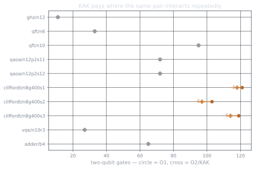

Part 4 ended with a useful loss. qcc's local passes left 718 two-qubit gates
across the benchmark, while Qiskit `-O2` left 703 and pytket left 634. The
missing operation was not another cancellation rule. It was the ability to
replace a whole two-qubit region with a shorter circuit for the same unitary.

That pass is implemented in
[qcc PR #1](https://github.com/drishans/qcc/pull/1). It is an `-O2` pipeline
built in seven pieces: collect a block, recover its unitary, find its KAK
coordinates, synthesize the optimal CX class, rebuild SSA, prove the rewrite
safe, then measure it against the same baselines.

One scope boundary matters before the details: these are **logical** qubits.
qcc still has no coupling map, placement, routing, or hardware calibration
model. The pass shortens interactions between circuit wires before any physical
device is chosen.

## 1. Collect one pair at a time

The collector starts at a two-qubit gate and grows a maximal contiguous block
containing only unitary operations on that pair. A measurement, barrier,
disjoint operation, or gate touching a third wire ends the block. The rule is
deliberately conservative. It never commutes work into a block and therefore
does not need to prove a new schedule equivalent.

```text title="a profitable pair-local block"
cx q[0], q[1];
h  q[0];
cx q[1], q[0];
t  q[1];
cz q[0], q[1];
rx(0.37) q[0];
cx q[0], q[1];
```

Multiplying those gates in execution order produces one $4\times4$ unitary
$U$. From this point the original spelling of the block no longer matters.

## 2. Put $U$ in the Weyl chamber

KAK, also called the Cartan decomposition, separates any two-qubit unitary into
local gates and one canonical interaction:

$$
U = e^{i\phi}(A_0\otimes A_1)
    e^{i(xX\otimes X+yY\otimes Y+zZ\otimes Z)}
    (B_0\otimes B_1).
$$

The four $A$ and $B$ matrices are single-qubit unitaries. The three interaction
coordinates are canonicalized into the Weyl chamber
$\pi/4 \ge x \ge y \ge |z|$. This turns many different gate sequences into the
same geometric point.

qcc implements this with NumPy, not Qiskit. It changes to the magic basis,
where local $SU(2)\otimes SU(2)$ operations become real orthogonal matrices,
simultaneously diagonalizes the real and imaginary parts, and then folds the
angles into the chamber. The numerically delicate simultaneous-diagonalization
routine is adapted from Cirq under Apache-2.0 and is called out in the repo's
`NOTICE`; the surrounding decomposition, wire conventions, and synthesis path
are qcc's.

## 3. Synthesize the exact CX class

The chamber coordinates tell us the minimum number of CX gates before we emit
anything:

| Weyl point | minimum CX |
| --- | ---: |
| $x=y=z=0$ | 0 |
| $(x,y,z)=(\pi/4,0,0)$ | 1 |
| $z=0$ otherwise | 2 |
| interior, $z\ne0$ | 3 |

qcc carries a direct template for each case. Local layers are fused back into
`u3` or `rz`, and every returned sequence is multiplied out once more before it
can enter the IR. The production path has no Qiskit or pytket import. Those
stacks remain baselines, not hidden implementation dependencies.

## 4. Rebuild both SSA wires atomically

This is where the value-semantics choice from part 1 earns its keep and also
demands care. A two-qubit gate consumes two qubit SSA values and returns two new
ones. Replacing several such gates one result at a time creates an awkward
half-rewritten graph in which dominance or linearity can be temporarily wrong.

The pass instead edits the circuit tape, rebuilds the complete `@main` function
with fresh qubit values, and swaps that function into the module once. The
linearity verifier then checks that every logical qubit value still has exactly
one consuming use. Measurements keep their original classical-bit targets.

## 5. Make every accepted rewrite pay

Canonical does not automatically mean cheaper. A one-CX block may synthesize to
one CX plus several local gates, which is worse than leaving the original
alone. Each candidate therefore has the lexicographic cost

$$
(\text{two-qubit gates},\ \text{total gates},\ \text{depth}).
$$

The candidate is accepted only when that tuple strictly improves. Two-qubit
cost comes first because it is the scarce resource this pass exists to reduce.
After each accepted KAK round, the `-O1` cancellations and one-qubit fusion run
again. `-O2` repeats this pair until the instruction tape stops changing, with
a fixed iteration cap as a backstop.

## 6. Test the algebra and the compiler boundary

The tests attack two different failure surfaces. Algebra tests cover known
zero-, one-, two-, and three-CX classes, Haar-random $U(4)$ matrices, locally
dressed chamber points, boundaries, degeneracies, and reversed operand order.
Qiskit's CNOT decomposer is used only as a test oracle for the predicted CX
class.

Compiler tests place blocks beside barriers, measurements, disjoint work, and
third-wire operations. Random whole circuits must remain statevector-equivalent
up to global phase, never increase their two-qubit count, pass the SSA
linearity verifier, and reach the same result when `-O2` is run again. The final
smokes then take optimized IR through QIR emission and CUDA-Q execution.

## 7. Rerun the scoreboard

The benchmark protocol is unchanged from part 4: identical logical inputs, no
backend or coupling map for Qiskit, `FullPeepholeOptimise` for pytket, five
optimization-only timing runs, and statevector verification for every qcc row.
The exact data and machine provenance are in
[`results/compile_bench.json`](https://github.com/drishans/qcc/blob/d96e9b135dc285694edddc0b2615eb1f2cab2cdb/results/compile_bench.json).

Across all ten instances, qcc `-O2` leaves 704 two-qubit gates. That is one more
than Qiskit `-O2`/`-O3` at 703, down from qcc `-O1` at 718. It also keeps a lower
total gate count than Qiskit: 1323 against 1372.

The gain is concentrated in the three random Clifford+T circuits:

| instance | qcc O1 2q | qcc O2 2q | Qiskit O2 2q | pytket 2q |
| --- | ---: | ---: | ---: | ---: |
| seed 1 | 121 | **118** | 119 | 95 |
| seed 2 | 103 | **97** | 101 | 81 |
| seed 3 | 119 | **114** | 116 | 95 |



Median optimization time rises from 8.4 ms at qcc `-O1` to 28.5 ms at `-O2`.
Qiskit `-O2` is 12.4 ms and pytket is 344.7 ms on the same machine. KAK is
small enough to remain interactive, but it is no longer a nearly free local
rewrite.

The unchanged rows are as informative as the wins. QFT's final swaps and
one-off controlled phases do not produce profitable contiguous blocks on the
same pair, so KAK removes nothing there. pytket still reaches 634 two-qubit
gates in aggregate because it applies a broader transform repertoire. Closing
that gap needs region formation that can see through intervening work, plus
target-aware synthesis after placement. KAK solved the missing local algebra;
it did not solve global circuit structure.

That is the useful shape of `-O2`: collect conservatively, canonicalize
independently, accept only a measured win, and let the verifier veto everything
else. The pass closes almost all of the Qiskit two-qubit gap without pretending
the rest is a constant-factor tuning problem.
