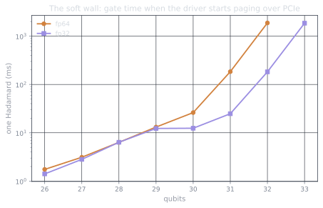
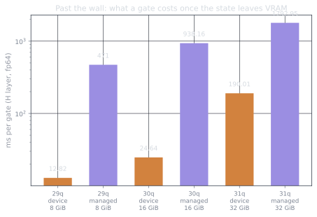

Part 1's arithmetic was unambiguous: at 31 qubits in fp64 the statevector is
32 GiB and the card holds 31.8. Allocation should fail. I wrote the
benchmark expecting to document exactly where `OutOfMemoryError` lands;
[`bench/01_memory_wall.py`](https://github.com/drishans/one-gpu-n-qubits/blob/main/bench/01_memory_wall.py)
literally has a code path for it.

That code path never ran at 31 qubits. Current NVIDIA drivers ship a *sysmem
fallback* policy: when VRAM runs out, `cudaMalloc` quietly succeeds anyway
and backs the overflow with ordinary system RAM, paged across PCIe on
demand. No error, no warning: the free-VRAM counter pins to zero and your
gate times absorb the consequences. The wall is still there. It's just soft.
Driver policies change between generations, so treat the specific behavior
as weather; the probe below is how you find out what your driver does.

## Measuring the cliff

One timed Hadamard per size (a 1-qubit gate reads and writes the whole
state, so it's a perfect probe of where the state actually lives):

| State size | fp64 qubits | Where it lives | One gate |
| ---------: | ----------: | --- | -------: |
|  8 GiB | 29 | VRAM | 13.1 ms |
| 16 GiB | 30 | VRAM | 26.2 ms |
| 32 GiB | 31 | **spilled** | **183.8 ms** |
| 64 GiB | 32 | **spilled** | **1,873 ms** |
| 128 GiB | 33 | — | allocation fails |

In VRAM, times double per qubit like clockwork. Then the state outgrows the
card, and adding a qubit stops costing 2×: the first spilled gate costs
**7× the last in-VRAM gate**, the next one **72×**. That's the cliff.

The shape of the slowdown is exactly what a paging story predicts. At
32 GiB, roughly half the state still sits in VRAM, so the speeds blend. At
64 GiB only a quarter does, and effective throughput sinks toward PCIe
bandwidth. Running the same probe in fp32 confirms the diagnosis with a
pleasing symmetry: **the cliff is priced in bytes, not qubits.** A 32 GiB
state costs ~183 ms per gate whether it's 31 qubits of fp64 or 32 qubits of
fp32; a 64 GiB state costs ~1.86 s either way. The qubit count is
incidental; the memory system neither knows nor cares what the bytes mean.

And the hard limit didn't vanish; it moved: allocation finally fails when
the state exceeds VRAM *plus* the RAM the OS will lend. On this machine
that's 31.8 GiB + ~44 GiB (WSL2 caps Linux at half the physical 96 GB;
raise it in `.wslconfig` if you need to), so 64 GiB squeaks in and 128 GiB
dies.

## The official tool loses to the automatic one

Sysmem fallback is a driver courtesy. The *designed* way to exceed VRAM is
CUDA managed (unified) memory: allocate with `cudaMallocManaged`, let the
runtime page on demand. Same H-gate probe, state on managed memory
([`bench/04_offload.py`](https://github.com/drishans/one-gpu-n-qubits/blob/main/bench/04_offload.py)):

| State | Device memory | Managed memory |
| ---: | ---: | ---: |
|  8 GiB (fits) | 12.8 ms · 1,248 GiB/s | 471 ms · **34 GiB/s** |
| 16 GiB (fits) | 24.6 ms · 1,299 GiB/s | 938 ms · **34 GiB/s** |
| 32 GiB (over) | 190 ms · 337 GiB/s | 1,793 ms · **36 GiB/s** |
| 64 GiB (over) | 1,873 ms · 68 GiB/s | *allocation fails* |

Read that table twice, because it's rude. On WSL2, managed memory runs at a
flat ~34 GiB/s, **even when the state would comfortably fit in VRAM**. The
pages simply never migrate to the device for this access pattern; every
touch crosses the bus. It's 37× slower than device memory at sizes where
managed mode has no reason to exist, it's 9× slower than the driver's
automatic spill at 32 GiB, and at 64 GiB (the one size where you'd
genuinely need it) it refuses outright while the automatic spill soldiers
on. (Native Linux reportedly treats managed memory better; I measured what
my machine does, and on WSL2 the verdict is: never.)

## What the wall means in practice

- **The working ceiling is the last in-VRAM size**: 30 qubits fp64, 31
  fp32. That's where you iterate, at ~1.2–1.45 TiB/s effective.
- **The spill zone is an emergency lane, not a lane.** +1 qubit at 7× per
  gate is defensible for a one-off: a single deep-circuit sanity check you
  genuinely can't shrink. +2 qubits at 72× means a 100-gate circuit takes
  three minutes; a real workload takes the weekend.
- **Watch `mem_info`, not exceptions.** The failure mode isn't an error
  anymore: it's your benchmark silently running 70× slow. If free VRAM
  reads zero, your numbers aren't measuring what you think. (This bit me
  *during this series*: an overlapping run poisoned a whole dataset, which
  is why `01_memory_wall.py` now refuses to start on a busy GPU.)

One qubit past the card costs an order of magnitude; two cost nearly two.
Brute force is officially out of road. To go meaningfully wider we have to
stop storing the state at all, which is Part 5.
