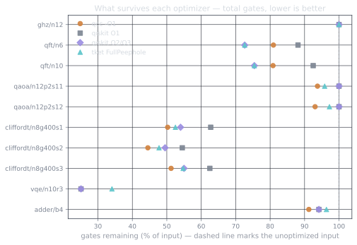
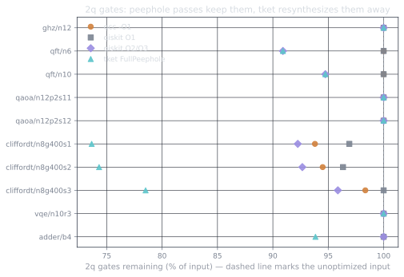
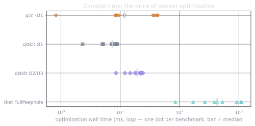

The first three parts built an IR (part 1), an oracle (part 2), and four
optimization passes (part 3). This part
takes the optimized circuit out of the compiler and into the world: it emits
QIR, runs on CUDA-Q, and then measures qcc against the two transpilers people
actually use. Every number here comes from
[`results/compile_bench.json`](https://github.com/drishans/qcc/blob/main/results/compile_bench.json),
stamped with the machine it ran on.

## QIR: back to the register model

QIR is the portable output, the LLVM-based format the broader quantum toolchain
speaks. It uses the pointer model from part 1, so emission walks the optimized
SSA and, through [pyqir](https://github.com/qir-alliance/pyqir), calls an
intrinsic per gate. The base profile is deliberately spare, so a few gates lower
on the way out: `u3` becomes `rz·ry·rz`, `swap` becomes three `cx`, the phase
gate becomes `rz`. A Bell pair comes out as:

```llvm title="uv run qcc compile examples/bell.qasm --emit qir"
define void @main() #0 {
entry:
  call void @__quantum__qis__h__body(ptr null)
  call void @__quantum__qis__cnot__body(ptr null, ptr inttoptr (i64 1 to ptr))
  call void @__quantum__qis__mz__body(ptr null, ptr null)
  call void @__quantum__qis__mz__body(ptr inttoptr (i64 1 to ptr), ptr inttoptr (i64 1 to ptr))
  ret void
}
```

## CUDA-Q: driving the GPU

For execution I target CUDA-Q. One finding worth recording, current as of CUDA-Q
0.15 (July 2026): there is no public API to ingest external QIR back into a
kernel. QIR is an output, not an input. So the execution backend builds a CUDA-Q
kernel from the same optimized IR through the kernel-builder API, and QIR stays
the portable artifact. If a later release adds QIR ingestion, that becomes a
second, simpler path; the recipe is to check whether `cudaq` has grown a
load-from-QIR entry point and prefer it when it exists.

On an RTX 5090 the `nvidia` target runs the Bell pair as expected, with a CPU
fallback when no GPU is present. One convention to watch: CUDA-Q orders
measurement bits with qubit 0 least significant, while qcc's simulator uses the
opposite convention, so comparing states means reversing the bit order first.

```text title="uv run qcc run examples/bell.qasm --shots 2000"
target: nvidia
00  976
11  1024
```

## The benchmark, and the rules

The point of a benchmark is that it can be lost, so the rules are strict and
stated up front. All three compilers receive the *identical* circuit, translated
to a common gate set at optimization level zero so nobody gets a head start from
a smarter frontend. Qiskit runs `transpile` with no backend and no coupling map,
which is logical optimization only, the same game qcc plays. pytket runs
`FullPeepholeOptimise`. Timings are the median of five runs of the optimization
call alone. Every qcc result is checked equivalent to the input by the part-2
oracle before it counts.

Ten suites: GHZ, the QFT at two sizes, QAOA max-cut, random Clifford+T, a
hardware-efficient ansatz, and a ripple-carry adder.

## Total gates

Lower is better. Qiskit's `-O2` and `-O3` produced identical gate totals on
every suite, so they share a column.

| suite | input | qcc | qiskit O1 | qiskit O2/O3 | pytket |
| --- | ---: | ---: | ---: | ---: | ---: |
| ghz n12 | 12 | 12 | 12 | 12 | 12 |
| qft n6 | 84 | 68 | 74 | **61** | **61** |
| qft n10 | 240 | 194 | 222 | **181** | **181** |
| qaoa n12 p2 (a) | 144 | **135** | 144 | 144 | 138 |
| qaoa n12 p2 (b) | 144 | **134** | 144 | 144 | 140 |
| clifford+T n8 (a) | 400 | **201** | 251 | 216 | 210 |
| clifford+T n8 (b) | 400 | **178** | 218 | 198 | 191 |
| clifford+T n8 (c) | 400 | **205** | 250 | 220 | 219 |
| ansatz su2 n10 | 267 | **67** | 67 | 67 | 91 |
| adder b4 | 137 | **125** | 129 | 129 | 132 |

Four local rewrites match or beat Qiskit's `-O2`/`-O3` on total gate count in
eight of the ten suites: six outright wins (both QAOA, all three Clifford+T, the
adder), two ties (GHZ, which is already minimal, and the ansatz), and two losses,
both QFT. Summed across every suite, qcc leaves 1319 gates standing against
Qiskit `-O2`/`-O3`'s 1372 and pytket's 1375.



## Two-qubit gates: where qcc loses

Total gate count is the flattering metric. On real hardware the two-qubit gates
are the expensive, error-prone ones, and here the story inverts.

| suite | input 2q | qcc 2q | qiskit O2 2q | pytket 2q |
| --- | ---: | ---: | ---: | ---: |
| clifford+T n8 (a) | 129 | 121 | 119 | **95** |
| clifford+T n8 (b) | 109 | 103 | 101 | **81** |
| clifford+T n8 (c) | 121 | 119 | 116 | **95** |
| qft n10 | 95 | 95 | **90** | **90** |

pytket removes roughly a quarter of the two-qubit gates on Clifford+T; qcc
barely touches them. This is not a tuning gap, it's a missing capability. qcc's
passes only ever cancel, merge, and fuse gates that are already there. pytket and
Qiskit's higher levels *collect two-qubit blocks and resynthesize them*, finding
shorter implementations of the same two-qubit unitary. That is also why Qiskit
wins both QFT rows and why pytket wins the 2q column everywhere. My compiler has
no pass that touches two-qubit structure, and this figure is that absence drawn
out.



## Compile time

Optimization is not free, and depth of optimization costs wall-clock. Median
across all suites: qcc 11 ms, Qiskit `-O1` 7 ms, `-O2` 15 ms, `-O3` 19 ms,
pytket 428 ms. qcc buys `-O2`-quality gate counts at closer to `-O1` compile
time, and runs tens of times faster than pytket's peephole pass, whose
resynthesis is the thing it's spending that time on.



## What this proves, and what it doesn't

Four local def-use rewrites, none longer than a screen, get you to parity with a
production transpiler's total gate count on most circuits, verified correct on
every one, at compile times that never embarrass you. That is the case for the
value-semantics IR from part 1: the optimizations are small because the data
structure did the hard part.

It does not get you two-qubit resynthesis, and the benchmark is honest about the
cost. Closing that gap means a pass that collects two-qubit blocks and rebuilds
them from their unitary, the KAK decomposition, which is the natural next thing
to build and a good subject for wherever this series goes next.

Every figure and number here regenerates from the repo with `uv run python
bench/run_bench.py`, on an RTX 5090 with Qiskit 2.5, pytket 2.18, CUDA-Q 0.15,
and xDSL 0.68, all recorded in the results JSON's provenance block.
