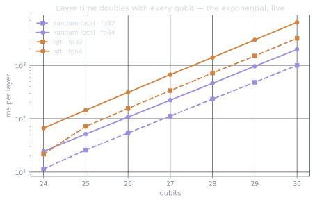
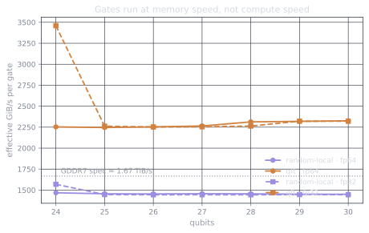

The stack is alive, the arithmetic says 30 qubits fp64 is the comfortable
ceiling. Time to run actual circuits and see what a gate costs as the state
grows. Scripts and raw JSON:
[`bench/02_gate_scaling.py`](https://github.com/drishans/one-gpu-n-qubits/blob/main/bench/02_gate_scaling.py)
and
[`bench/03_sampling.py`](https://github.com/drishans/one-gpu-n-qubits/blob/main/bench/03_sampling.py)
in the series repo.

## The protocol

Two circuit families, chosen because they stress the memory system
differently, or so I believed when I chose them:

- **random-local**: a random phase + a Hadamard on every qubit, then a ring
  of CX. Friendly, textbook access patterns.
- **qft**: the quantum Fourier transform. $n(n{+}1)/2$ controlled phases,
  increasingly long-range. The classic "poor locality" suspect.

Timing on a GPU has one iron rule: never trust the wall clock around async
kernel launches. CUDA events, a warmup pass for the allocator and kernel
autotuning, then the mean of three timed repetitions:

```python title="the timing loop that matters" {5-9}
layer()                                  # warmup, discarded
cp.cuda.runtime.deviceSynchronize()

start, end = cp.cuda.Event(), cp.cuda.Event()
for _ in range(reps):
    start.record()
    layer()
    end.record()
    end.synchronize()
    times.append(cp.cuda.get_elapsed_time(start, end))   # ms, GPU-side
```

## The exponential, on schedule

One random-local layer, fp64, mean of three runs:

| Qubits | State | ms / layer | ms / gate |
| -----: | ----: | ---------: | --------: |
|     24 | 256 MiB |     24.5 |      0.34 |
|     26 |   1 GiB |    107.3 |      1.38 |
|     28 |   4 GiB |    461.7 |      5.50 |
|     30 |  16 GiB |  1,985.1 |     22.06 |

Every row is 2.07× the row two above it would predict: the doubling is so
clean you could set a metronome by it. At 30 qubits, one layer of one gate
per qubit takes two seconds. A thousand-layer circuit is a lunch break. The
exponential doesn't negotiate; it just hasn't gotten *steep* yet.



## The gate is a memcpy

Part 1 claimed a 1-qubit gate is really a full read + write of the state.
The data agrees with unreasonable precision. Dividing traffic by time gives
an effective bandwidth per gate, and for random-local it's a flat line:

$$
\text{BW}_{\text{eff}} = \frac{2 \times 2^n \times 16 \text{ B}}{t_{\text{gate}}}
\;\approx\; 1{,}450 \text{ GiB/s} \quad \text{(fp64, every size, } \sigma < 1\%)
$$

That's **87% of the card's ~1.67 TiB/s paper bandwidth**, sustained across
six state-size doublings, in both precisions. The compute units are idling;
the memory controller is flat out. "Statevector simulation is
memory-bandwidth-bound" isn't a slogan, it's a horizontal line.



Corollary: **fp32 is half the cost of fp64, almost to the digit**. The
ratio sits at 1.98–1.99 everywhere except the smallest size, where
launch overhead wobbles it. You're paying for bytes moved, not arithmetic
done. Single precision buys one extra qubit *and*
halves every gate time, at the price of numerical headroom you should
actually think about before taking (norm drift over deep circuits is real;
these shallow benchmark layers don't probe it, so I won't pretend they do).

## The QFT refused to be slow

Here's the part I got wrong in advance. I picked the QFT as the villain:
long-range controlled gates, poor locality, surely the memory system
suffers. The measurement:

| Family (30q, fp64) | ms / gate | "effective" GiB/s |
| --- | ---: | ---: |
| random-local | 22.06 | 1,451 |
| qft          | 13.76 | **2,325** |

The QFT is per-gate *faster*, and its apparent bandwidth is **above the
physical limit of the memory bus**. A 5090 cannot move 2.3 TiB/s; when a
measurement says it did, the traffic model is wrong, not the card. And it
is: a controlled-phase gate is diagonal, so cuStateVec doesn't pair up and
rewrite the whole statevector for it. It multiplies the quarter of
amplitudes where control and target are both 1, and touches nothing else.
Less traffic per gate, more gates per second, model refuted.

Two lessons, one about physics and one about engineering: the cost of a gate
depends on its *structure*, not just the state size. And the library is
smarter than your mental model of it. Measure before you predict which
circuit will hurt.

## Measurement is nearly free (on a simulator)

A statevector simulator holds the entire distribution, so "measuring" is
sampling from an array you already have. cuStateVec does one preprocessing
pass (building the cumulative distribution, ~11 ms over an 8 GiB state,
independent of shot count) and then draws are almost free:

| Shots | Preprocess | Draw |
| ----: | ---------: | ---: |
| 1,000 | 11 ms | 0.9 ms |
| 100,000 | 11 ms | 2.9 ms |
| 1,000,000 | 12 ms | **22.8 ms** |

A million measurements in 23 milliseconds. On hardware, a million shots is
a coffee break and a calibration drift; here it's a rounding error. When a
simulation paper quotes gigantic shot counts, this is why nobody blinked.

My favorite detail in the whole dataset: sampling the uniform superposition
over $2^{30}$ outcomes a million times returned 999,565 *distinct*
bitstrings. The birthday problem predicts $\binom{10^6}{2}/2^{30} \approx
466$ collisions; we observed 435, well within a Poisson deviation. The
benchmark quietly contains its own statistical correctness test: the
sampler is drawing from the distribution it claims to.

## Where this leaves us

Thirty qubits, fp64, at 87% of theoretical memory bandwidth: a full QFT in
6.4 seconds, measurement effectively free. One desk, no cluster. The
exponential is present but polite. Every qubit doubles the bill, and the
bill is still payable.

At 31 qubits, the arithmetic says the state no longer fits. Part 1 spoiled
that the card doesn't throw an error there. What it does instead, and what
it costs, is next.
