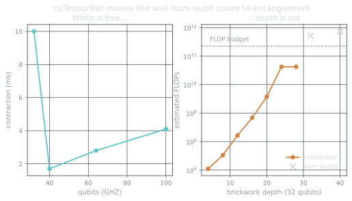

Four parts of this series treated one assumption as physics: to simulate
$n$ qubits you store $2^n$ amplitudes. Parts 1–4 measured that assumption's
price — a hard budget of 30-ish qubits, then a cliff.

But the assumption is a choice. If what you want from a circuit is *one
number* — an amplitude, an expectation value, a correlator — you don't need
the whole state at any point. A quantum circuit is a network of small
tensors (one per gate) glued along shared indices, and the amplitude
$\langle 0{\cdots}0 | C | 0{\cdots}0 \rangle$ is what falls out when you
contract the entire network down to a scalar. Storage stops scaling with
qubit count; it scales with the largest *intermediate* tensor the
contraction order produces. That's what cuTensorNet does, and its Python API
is disarmingly small:

```python title="an amplitude without a statevector"
from cuquantum import tensornet as tn

conv = tn.CircuitToEinsum(circuit, dtype="complex128", backend=cp)
expr, operands = conv.amplitude("0" * n)      # an einsum, not a statevector
net = tn.Network(expr, *operands)
path, info = net.contract_path()              # cost model runs BEFORE you pay
amp = net.contract()
```

That `info` object is the underrated hero: it tells you the estimated FLOPs
and the largest intermediate **before you commit**, which makes "should I
even attempt this" a question you can answer in milliseconds. All numbers
below are from
[`bench/05_tensornet.py`](https://github.com/drishans/one-gpu-n-qubits/blob/main/bench/05_tensornet.py).

## Width is free

GHZ states — maximally entangled in the textbook sense, but with a simple,
tree-like circuit structure. Amplitude of $|0\cdots0\rangle$, which should
be exactly $1/\sqrt{2}$:

| Qubits | Contraction | Amplitude returned |
| -----: | ----------: | ---: |
|  32 | 10.0 ms | 0.707107 |
|  64 |  2.8 ms | 0.707107 |
| **100** | **4.1 ms** | **0.707107** |

A 100-qubit amplitude in four milliseconds, correct to six digits. For
scale: the statevector for 100 qubits would need $2^{100} \times 16$ bytes —
about $10^{31}$ bytes, a hundred million times all the storage humanity has
ever manufactured. The contraction never materializes it, so it never pays
for it.
Qubit count, the villain of parts 1–4, has simply left the story.

## Depth is not

Something else must pay instead, and a second circuit family finds it:
brickwork random circuits — alternating layers of random single-qubit
rotations and CX bricks, the standard stand-in for "genuinely entangling,
no exploitable structure." Width fixed at 32 qubits, depth cranked:

| Depth | Est. FLOPs | Largest intermediate | Contraction |
| ----: | ---------: | ---: | ----------: |
|     8 |    1.1×10⁵ | tiny | 43 ms |
|    16 |    4.7×10⁷ | tiny | 14 ms |
|    20 |    1.4×10⁹ | 8 MiB | 85 ms |
|    24 |    1.8×10¹¹ | 4 GiB | 569 ms |
|    28 |    1.8×10¹¹ | 2 GiB | 1,068 ms |
|    32 |    2.7×10¹³ | 8 GiB | *over budget* |
|    40 |    5.4×10¹³ | 8 GiB | *over budget* |



The estimated cost climbs **nine orders of magnitude while the qubit count
never moves.** Around depth 24 the intermediates hit gigabytes and a single
amplitude costs half a second; by depth 32 the optimizer quotes $2.7 \times
10^{13}$ FLOPs and my benchmark's self-imposed budget (5×10¹², roughly "a
few seconds of GPU") declines to pay. The wall from part 1 is back — it
just changed currency, from *bytes of state* to *entanglement the
contraction has to squeeze through*. Physicists will recognize the shape:
for volume-law circuits, treewidth grows with depth×width, and the
exponential always collects eventually.

One more honest ledger line: the *path-finding* isn't free either — 1.5 s
of CPU hyper-optimization at depth 40, before any GPU work. And a single
amplitude is not a simulation: sampling bitstrings from a deep random
circuit needs many amplitudes or smarter (and costlier) contraction
strategies. Width-versus-depth is a genuine trade, not a loophole.

## What one GPU actually buys — the series ledger

Every number measured on one RTX 5090 (driver 610.62, CUDA 13 runtime
wheels, cuQuantum 26.6.0, cuPy 14.1.1, Qiskit 2.5.0, WSL2 Ubuntu 24.04),
reproducible from [the repo](https://github.com/drishans/one-gpu-n-qubits):

| Regime | Ceiling | Speed |
| --- | --- | --- |
| Statevector, fp64 | 30 qubits | ~1.45 TiB/s effective — 87% of the card's memory bandwidth |
| Statevector, fp32 | 31 qubits | same bandwidth, half the bytes, one more qubit |
| Driver sysmem spill | +1–2 qubits | 7× to 72× per-gate penalty — emergencies only |
| Managed memory (WSL2) | worse than the spill in every measured way | 34 GiB/s, flat |
| Tensor network, structured/shallow | 100+ qubits | milliseconds per amplitude |
| Tensor network, volume-law | depth ~28 at width 32 | ~1 s per amplitude, exponential past it |

The one-sentence version: **a consumer GPU simulates quantum circuits at
the speed of its memory and the size of its memory — and every route past
that trades exponentially in some other direction.** Which is, of course,
the whole reason quantum hardware is worth building.

Where this series goes next, when bench time allows: cuQuantum 26.6 shipped
two new libraries — cuStabilizer (Clifford circuits at scales where none of
this article's math applies) and cuPauliProp — and error correction is
where those shine. A logical qubit needs a few thousand physical gates per
cycle; simulating *that* pipeline on this card is a different series, and
the itch has already started.
