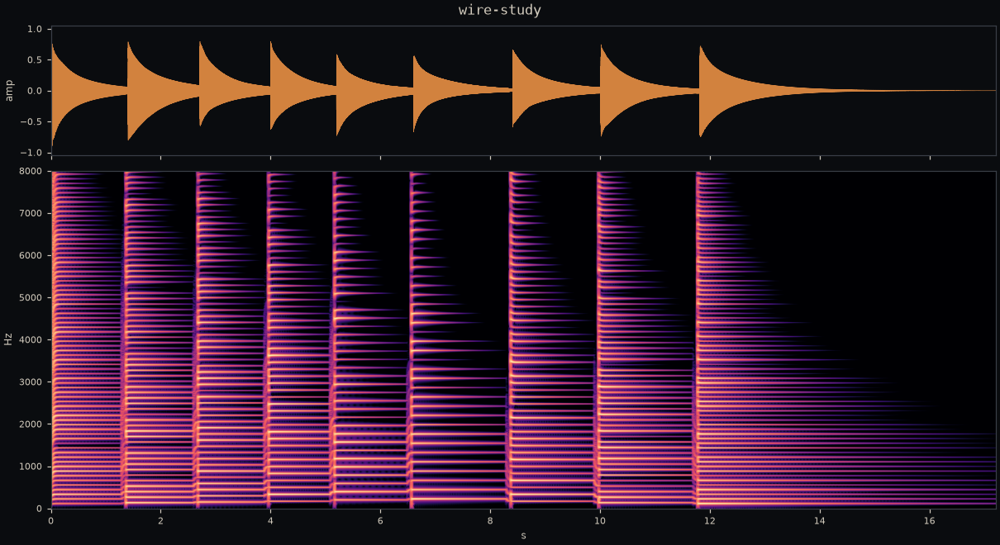
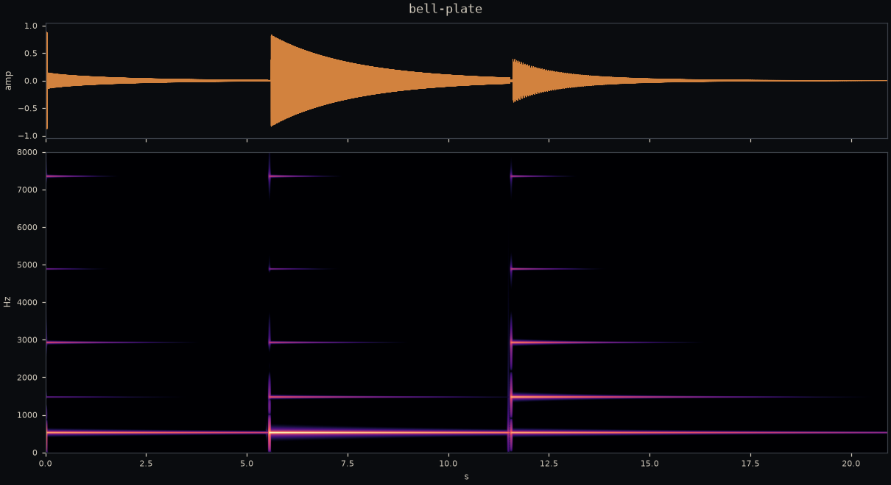
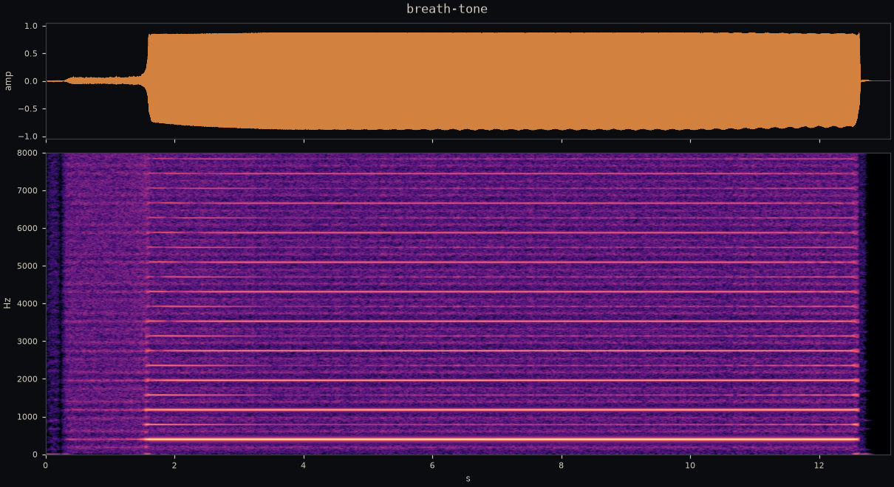

There are two ways to make a computer sound like an instrument. You can record
an instrument and play the recording back; that's sampling, respectable and
solved. Or you can teach the computer the *physics* and let the sound fall
out. The second way is called physical modeling, and its dirty secret is how
little code it takes: each instrument in this series is about sixty lines of
[Faust](https://faust.grame.fr), and every timbral knob corresponds to
something you could point at on the real object. Pick position. Mallet
hardness. Blowing pressure.

I built three, one per way of making an object vibrate: a **plucked wire**, a
**struck bar**, a **blown pipe**. They live in
[this repo](https://github.com/drishans/plucked-struck-blown), they play in
your browser (part 2), six pieces performed on them hang in the
[sound gallery](https://audio.drishan.com), and in part 3 I make a GPU listen
to one and reverse-engineer it. Everything below is measured, not asserted;
the measurement scripts are committed next to the instruments.

Better than reading about them: play them. The workbench below is the
actual instruments, compiled to nine kilobytes of WebAssembly each
(part 2 explains how), running live in your tab once you press power.

<psb-workbench class="widget">
  
<em>The playable workbench needs JavaScript. Without it, the pieces
  in the gallery are the same instruments, recorded.</em>

</psb-workbench>

## The wire: Karplus–Strong, taken seriously

The 1983 Karplus–Strong algorithm is the "hello world" of physical modeling:
fill a delay line with noise, loop it through a mild lowpass, and out comes a
shockingly convincing plucked string. The reason it works is that it *is* a
string (the delay line is the wave's round trip, the filter is energy loss),
so the way to make it better is to take the physics more seriously, term by
term.

My version adds four things, each one a real property of a real string:

- **Pick hardness.** The excitation is one period of noise through a lowpass
  at $400 + 9000\cdot h^2$ Hz. A thumb and a plectrum differ mostly in how
  much treble they let into the string.
- **Pick position.** Plucking at fraction $p$ of the length notches every
  harmonic with a node there: a feedforward comb, $x - x_{[pP]}$. In the
  gallery piece *Wire study* you can watch the notches walk as the pluck
  point moves toward the bridge.
- **Decay as a physical parameter.** The loop multiplies by $g$ once per
  round trip, and a round trip happens $f$ times a second, so
  $g = 0.001^{1/(f\,t_{60})}$ gives *exactly* a $t_{60}$-second decay to
  −60 dB. No magic gain constants: you ask for a five-second string, you
  get one.
- **Dispersion.** Real steel is stiff, and stiffness makes high frequencies
  travel faster, which stretches upper partials sharp. That is the piano's
  signature inharmonicity. Three first-order allpasses with a negative
  coefficient reproduce it: group delay falls with frequency, upper
  partials see a shorter string, and they land sharp on cue.

The delay line then makes up whatever the filters didn't use, so the loop
still totals one period. Measured against intent: a 220 Hz pluck comes out at
219.93 Hz, **0.6 cents flat**. I'll take it.

## The bar: nine modes and a contact time

A struck metal bar doesn't have harmonics. A free–free bar (xylophone key,
glockenspiel plate) vibrates at measured ratios of the fundamental,

$$
1 : 2.756 : 5.404 : 8.933 : 13.34 : \ldots
$$

and that refusal to line up is *why* metal sounds like metal. So the bar
model doesn't simulate a waveguide at all. It's **modal synthesis**: nine
resonant filters at those ratios, each rung by the same strike and left to
ring with its own decay time, $t_{60}(k) = t_{60} \cdot r_k^{-\alpha}$, high
modes dying faster the way damping in real materials prefers.

Two parameters carry all the musical character, and both are geometry:

- **Strike position** weights each mode by whether you hit its node line:
  $|\sin((k{+}1)\,\pi x)|$, so a center strike mutes the even modes and an
  edge strike wakes everything. The gallery piece *Bell plate* is one bar
  struck three ways; the chord changes because the node-line arithmetic does.
- **Strike hardness** is a *contact time*, not a volume. The strike is a
  raised-cosine force pulse between 0.2 ms (hard mallet) and 3.2 ms (soft),
  and a pulse that long simply can't push on a mode whose period is shorter
  than the contact. That is the physically honest lowpass. Soft mallets
  don't "filter" the bar; they never excite it.

Because every mode is an explicit filter with an explicit decay, this
instrument is *checkable*, and I checked it. Designed versus measured, from
the calibration strike at 440 Hz:

| mode | designed $t_{60}$ | measured $t_{60}$ |
| --- | --- | --- |
| 440.0 Hz | 10.00 s | 10.02 s |
| 1212.9 Hz | 4.02 s | 4.02 s |
| 2377.7 Hz | 2.20 s | 2.19 s |

Mode frequencies land within a quarter cent. This exactness is the setup for
part 3: if the synth *is* a sum of decaying sines with known parameters, a
fit that claims to recover them can be graded against an answer key.

## The pipe: the loop picks its own note

The blown pipe is a different animal, because unlike the wire and the bar it
is an *oscillator*: energy goes in continuously, and the pitch is whatever
frequency the feedback loop decides to sing at. You don't set the note. You
negotiate.

The model is Cook's slide-flute topology from STK: breath pressure feeds a
**jet delay** into a cubic nonlinearity $x(x^2 - 1)$, which dumps into a
**bore delay** closed by an inverting lowpass reflection, the open pipe end.
The cubic is the whole flute. Below $|x| \approx 1$ it's just an inverting
gain, and the loop hisses quietly; push the pressure past the fold and the
waveform creases once per round trip, and that crease *is* the tone. Blow
harder still and it chokes. My model speaks from breath ≈ 0.95 and gives up
past ≈ 1.35, which anyone who has played a recorder will recognize as fair.

Then I asked it for 440 Hz and got 607.

Naively, a bore one period long should resonate at the period. Instead the
measured pitch sat a wide, *consistent* interval sharp, so instead of
re-deriving jet-drive theory at 3 a.m. I did the empirical thing: a grid
over bore lengths and jet ratios, measuring what came out. One line of the
grid was rock solid. With the jet at a third of the bore, every bore length
$B$ (in target periods) produced

$$
f_\text{out} \cdot B \approx 1.504 \, f_\text{target},
$$

four bore lengths agreeing to the third decimal. Which means the loop is an
inverting resonator speaking on its **m = 1 odd mode** at $3\,\mathrm{SR} /
(2 D)$. The flute is *always overblown*. Set the bore $1.504$ periods long
and the note lands on pitch.

And here's the part I enjoyed most: STK's `Flute::setFrequency` multiplies
the requested frequency by a bare, uncommented `0.66666` before computing
its delay. $1/1.5 = 0.6\overline{6}$. That constant is this measurement,
fossilized. Cook knew; the code just never said.

Calibrated, the pipe holds its register from C4 to G6 within 6 cents (below
C4 it jumps registers, which is what short pipes do; the slider now stops
where the physics does). Vibrato is applied to *breath*, not frequency,
because that's where flutists put it. Articulation in the gallery piece
*Air phrase* is nothing but a 60 ms dip below speaking pressure.

## One lesson the hard way

The gamelan piece wants a low gong ringing *under* a melodic run played on
the same bar. First render: the moment the run retuned the instrument, the
gong's tail bent with it, because a ringing resonator's state lives inside
its filter coefficients, and you cannot move the poles without moving the
sound already inside them. The fix is the same one every polyphonic synth
ever shipped: another voice. The renderer now runs one modal bank per voice
and sums them, and the gong rings out unbothered for eighteen seconds.

Next: [compiling all three to WebAssembly small enough to embed in a blog
post, and rendering the gallery pieces from Node](/writing/faust-to-wasm-audioworklet).
The entire wire, physics and all, is nine kilobytes.
